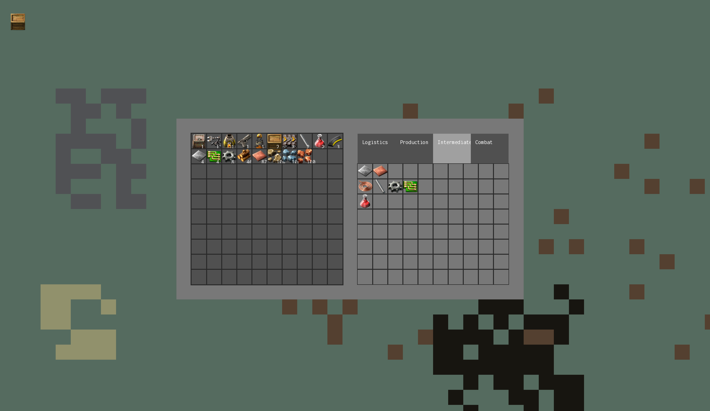
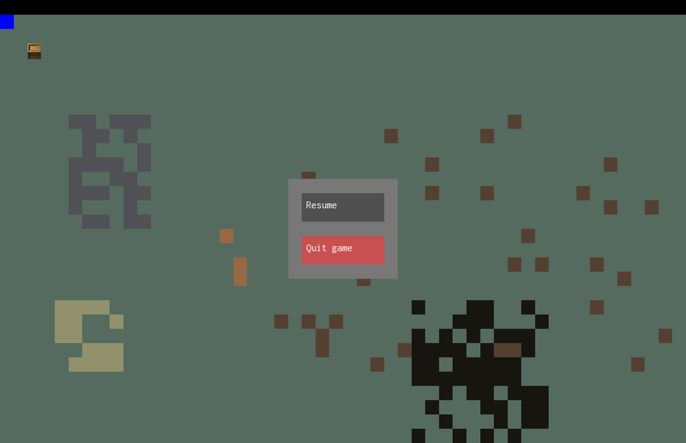
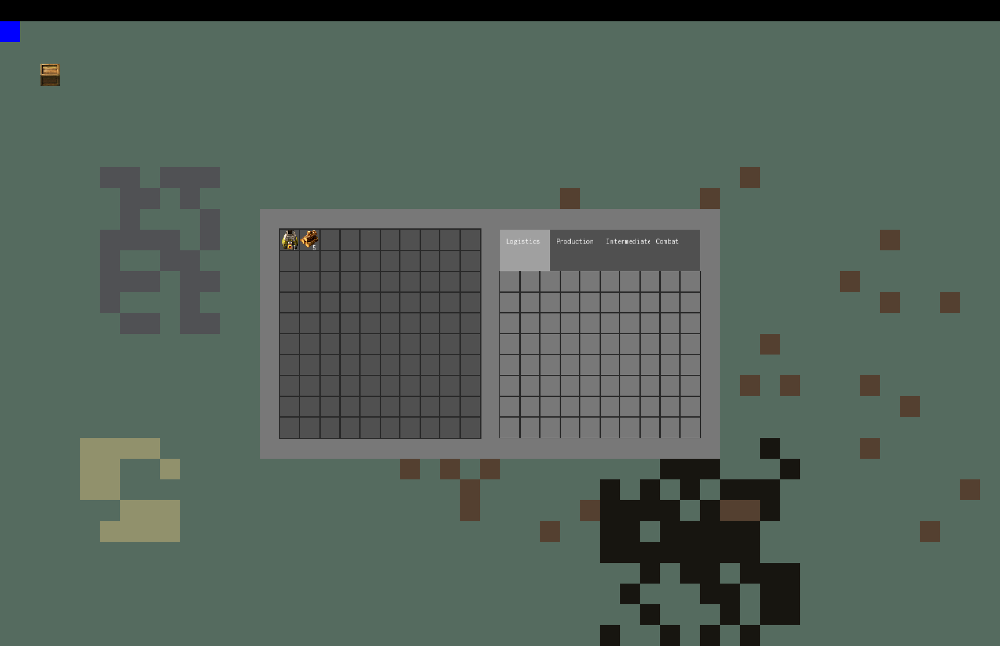
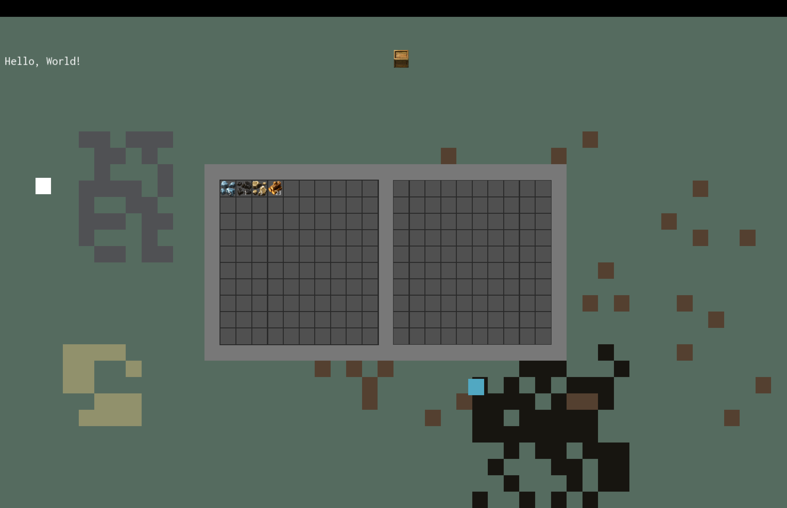
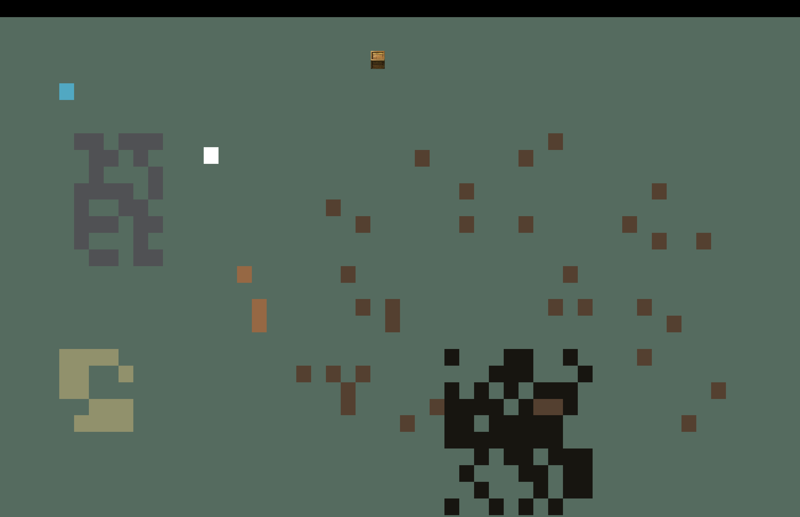

# 2024-08-25 Sun

Got the crafting screen working, with instant crafts!

I also added all of the recipe types for starter-game items (i.e. things you don't need to research).

# 2024-08-24 Sat

Did a large overhaul of the UI, refactoring into a custom tree-based system with relative positions for each renderable element. This allows the rendering logic to exist in the classes that actually need to be rendered, with each node only concerned with its own rendering.

Also started supporting mouse actions, such as clicking on items to pick them up out of inventory slots.

Next, I added a basic escape menu, and started working on the crafting panel:

# 2024-08-05 Mon

Started rendering a basic grid inventory with item counts. Started factoring out a generalisation of items that will work for both rendering and interactivity - a "scene node" tree.

# 2024-08-04 Sun

Fixed some issues with pointers. Imported image resources from the real game (behind a gitignore).

